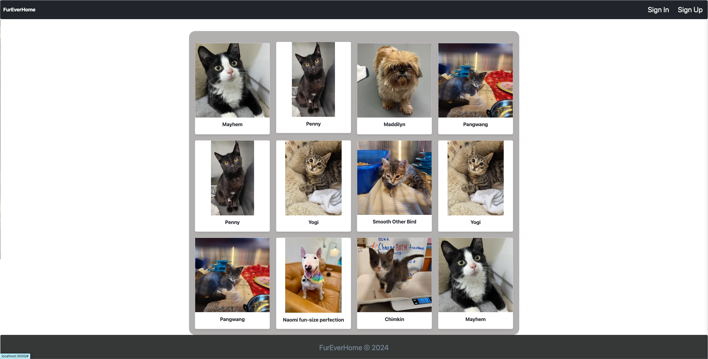

# FurEverHome

## Overview

FurEverHome is a pet adoption portal designed to connect potential adopters with pet owners. The platform allows users to browse pets available for adoption, filter them by type and location, and contact pet owners to inquire about adoption. Pet owners can create and manage profiles for their pets, ensuring a secure and user-friendly experience.

## Demo

Check out the live demo of the app [here](https://fur-ever-home-ae2443c63720.herokuapp.com/).

## Features

### User Stories

- **As a user**, I want to easily browse pets available for adoption, filter them by type and location, and contact the pet owner to inquire about adoption.
- **As a pet owner**, I want to create a profile for my pet, add details like age and breed, and manage my pet's adoption profile securely.

### MVP Functionality

#### Core Features

1. **Authentication and Authorization**:

   - Users can sign up and log in.
   - Session-based authentication ensures security.
   - Only logged-in users can create, edit, or delete pet profiles.
   - Users can edit their own pet profiles and comments.
   - Users can remove comments made on their pets.

2. **CRUD for Pet Profiles**:

   - Logged-in users can:
     - Create a pet profile (name, age, breed, type, description, vaccination, location, and image/images).
     - Edit or delete their own pet profiles.
   - Visitors can view pet profiles but cannot edit or delete them.
   - Visitors can add comments on other people's pets.

3. **Pet Profile Pages**:

   - Each pet has a detailed profile page displaying:
     - Name, breed, age, type (e.g., dog, cat), description, vaccination, location, and an image/images.
     - Contact form or contact details for the owner.

4. **Filtering and Searching**:

   - Visitors and users can search for pets by type (e.g., dog, cat), breed, location, and other criteria.
   - Advanced filtering options to narrow down search results.

5. **Favorites**:

   - Logged-in users can add pets to their favorites list.
   - Users can view and manage their favorite pets.

6. **Adoption Requests**:

   - Logged-in users can send adoption requests to pet owners.
   - Pet owners can view and manage adoption requests for their pets.

7. **Comments**:
   - Visitors and users can leave comments on pet profiles.
   - Logged-in users can edit or delete their own comments.

## Installation

1. Clone the repository:

   ```bash
   git clone https://github.com/yourusername/FurEverHome.git
   cd FurEverHome
   ```

2. Install dependencies:

   ```bash
   npm install
   ```

3. Set up environment variables:

   - Create a `.env` file in the root directory.
   - Add the following environment variables:
     ```
     MONGODB_URI=your_mongodb_connection_string
     SESSION_SECRET=your_session_secret
     GOOGLE_MAPS_API_KEY=your_google_maps_api_key
     PETFINDER_API_KEY=your_petfinder_api_key
     PETFINDER_API_SECRET=your_petfinder_api_secret
     ```

4. Start the application:

   ```bash
   npm start
   ```

5. Alternatively, you can use nodemon for automatic restarts during development:
   ```bash
   npm install -g nodemon
   nodemon
   ```

## Usage

1. **Sign Up**: Create a new account by clicking on the "Sign Up" button on the homepage.
2. **Login**: Log in to your account using your email and password.
3. **Create Pet Profile**: Navigate to "Add a New Pet" to create a new pet profile.
4. **View Pet Profiles**: Browse through the list of available pets on the homepage.
5. **Edit/Delete Pet Profile**: Edit or delete your own pet profiles from the "Your Pets" section.
6. **Add to Favorites**: Add pets to your favorites list by clicking the "Add to Favorites" button on the pet profile page.
7. **Send Adoption Request**: Send an adoption request to the pet owner from the pet profile page.
8. **Leave Comments**: Leave comments on pet profiles and interact with other users.

## Adding Pets with `addPets.js`

The `addPets.js` script is used to fetch pets from the Petfinder API and add them to your MongoDB database. This script is useful for populating your database with sample pet data for testing and development purposes.

### How it Works

1. **Fetch Access Token**: The script fetches an access token from the Petfinder API using your API key and secret.
2. **Fetch Pets**: The script uses the access token to fetch a list of pets from the Petfinder API.
3. **Add Pets to Database**: The script iterates over the fetched pets and adds them to your MongoDB database.

### Running the Script

1. Ensure your `.env` file contains the necessary environment variables:

   ```
   MONGODB_URI=your_mongodb_connection_string
   PETFINDER_API_KEY=your_petfinder_api_key
   PETFINDER_API_SECRET=your_petfinder_api_secret
   ```

2. Run the script:
   ```bash
   node addPets.js
   ```

## Technologies Used

- **Frontend**: HTML, CSS, JavaScript, Bootstrap
- **Backend**: Node.js, Express.js
- **Database**: MongoDB, Mongoose
- **Authentication**: Passport.js
- **APIs**: Petfinder API, Google Maps API

## Screenshots

### Homepage



### Pet Profile


### Add a New Pet


### Your Pets


## Contributing

Contributions are welcome! Please fork the repository and create a pull request with your changes.
